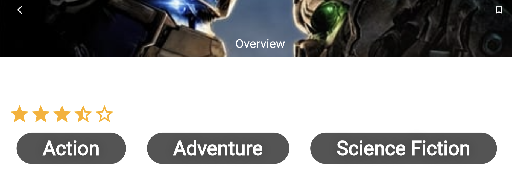
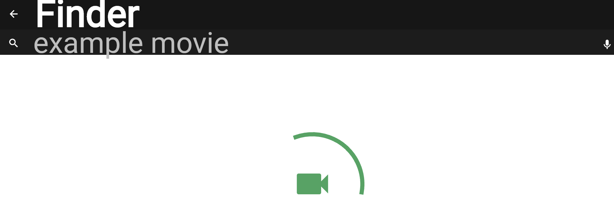

# :camera:Auto Curated Movie Lists 
## This projects aims to provide lists containing only *great* movies to users based only a gew filters and search parameters. :cd:

 *Disclaimer*: Everyhting in the Backend folder is working. We still have a problem handling all 5 lists at once. The code that handles all lists exists in*matching.py* but since it doesn't work as expected we also have a function that only compares 2 lists. The output of the matching of the two lists is in *final_movies.csv*. We will update the code when to bug is fixed.

### Our Aim
- Identify Movie Websites: We used websites with lists of "good movies". We chose lists of movies based not on user reviews or personal taste. Most lists come from the opinions of hundreds of film critics around the world and are.
 
- Implement Web Scraping: We then scraped those websites using Python in order to extract the info we needed.

- Match Data: After the web scraping process we are left with 5 lists. We want to match those lists and create a single one without duplicates or "bad" data.
 
- Define TMDB API Integration and extract movie information: using TMDB's public API we want to get further information for each movie. Such information would be the release date, genres, language etc. We will use this informations to filter the movies based on the user search query.

- Apply Filters and Parameters: Design and implement the filter and parameter functionality in your web app's user interface. Allow users to input their desired filters, such as genre, release year, rating, etc. Capture the user inputs and incorporate them into the search query for further processing.
 
- On-the-Fly Integration and Processing: Combine the extracted movie titles from web scraping with the retrieved movie information from the API on the fly. Match the movie titles between the scraped data and API responses to associate the relevant movie details with each title. Perform any necessary data transformations or filtering based on the user's input filters.
 
- Generate Search Results: Apply the user's selected filters and parameters to the integrated and processed data. Sort and rank the movies based on relevance or other criteria. Generate the search results, including the movie titles and associated information, such as synopsis, release date, and other details.
 
- Present Results to Users: Display the search results to the users through a user-friendly interface. This can be in the form of a list, grid, or any other suitable format. Consider including pagination or infinite scrolling if there are many search results to display.
 
- Continual Improvement: Regularly monitor the movie websites for changes in structure or accessibility, and adjust the web scraping scripts accordingly. Stay updated with the movie information API's documentation and ensure compatibility with any changes they introduce. Gather user feedback to improve the search functionality and refine the integration process.

### Our Project Structure
1. Scraping
2. Data Matching
2. API Integration
3. On-the-Fly Integration and Processing
4. Applying Filters and Parameters
5. Using **Flutter** for web integration
   
##### For our scraping sources we used the following lists:
- [Complete National Film Registry from the Library of Congress](https://www.loc.gov/programs/national-film-preservation-board/film-registry/complete-national-film-registry-listing/)
- [They Shoot Pictures Don't They? annual list of the 1000 greatest films (2023 edition)](https://www.theyshootpictures.com/gf1000_all1000films.htm)
- [The complete Criterion Collection](https://www.criterion.com/)
- [Sight and Sound (British Film Intitute's magazine) "The Greatest Films of All Time" list](https://www.bfi.org.uk/sight-and-sound/greatest-films-all-time)
- [American Film Institute's 100 Years...100 Movies list](https://www.afi.com/afis-100-years-100-movies-10th-anniversary-edition/)

Using basic `BeautifoulSoup` structure
```python
def scrape_movie_titles(url):
    response = requests.get(url)
    soup = BeautifulSoup(response.text, 'html.parser')
    # Extract movie titles from the HTML structure
    titles = soup.find_all('h2', cdlass_='movie-title')
    movie_titles = [title.text for title in titles]
    return movie_titles
```
## Data Matching
For Data Matching we used Python's RecordLinkage library.
We opted for RecordLinkage instead of a simple concatenation because the titles of the movies aren't always exactly the same across two lists. For example we have "The Godfather" in a list and "The Godfather trilogy" in another, but we only need to keep one.
RecordLinkage contains various smart indexing and blocking methods and functions to compare records. It uses techniques like Levenshtein distance and Jaccard similarity to compare strings or elements. 
In our application we iteratively compare all pairs of lists to find movies appearing on both lists. We check that both the titles are similar enough (based on a threshold) and that the years (if available) are the same.
The output after this step is a sinlge DataFrame containing every movie appearing at least once in some list, without any duplicates. 

## Flutter Application

### Operating Principle

 The app sends requests and receives responses from the themoviedb API. <br> To learn more about `APIs` and the `Multitier architecture` click <a target="_blank" href="https://en.wikipedia.org/wiki/Multitier_architecture#Web_development_usage">here</a>.
 
<a target="_blank" href="https://volansys.com/wp-content/uploads/2019/07/VOLANSYS_Tiers-of-Architecture-new.jpg">  </a>

....in this phase we integrate via api calls our .  csv and we try to macth our movie titles with the TMDB database in order to extract our list.

## Dependencies
- `Sizer`: <a target="_blank" href="https://pub.dev/packages/sizer">https://pub.dev/packages/sizer</a>
- `Flutter Spinkit`: <a target="_blank" href="https://pub.dev/packages/flutter_spinkit">https://pub.dev/packages/flutter_spinkit</a>
- `Cached Network Image`: <a target="_blank" href="https://pub.dev/packages/cached_network_image">https://pub.dev/packages/cached_network_image</a>
- `Fluttertoast`: <a target="_blank" href="https://pub.dev/packages/fluttertoast">https://pub.dev/packages/fluttertoast</a>
- `Http`: <a target="_blank" href="https://pub.dev/packages/http">https://pub.dev/packages/http</a>
- `Path Provider`: <a target="_blank" href="https://pub.dev/packages/path_provider">https://pub.dev/packages/path_provider</a>
 
## Getting Started
This application is using api of <a target="_blank" href="https://www.themoviedb.org/">themoviedb</a>, so before using it you have to create an api from <a  target="_blank" href="https://www.themoviedb.org/">themoviedb</a> and generate an API and apply it to this application, follow the below step to connect api with this app.

First go to <a target="_blank" href="https://www.themoviedb.org/documentation/api">https://www.themoviedb.org/documentation/api</a>, and follow the API Documentation, you will get the API Code.

- go to `secret/the_moviedb_api.dart`
- you will see the code like this

```dart
const String themoviedbApi = 'XXXXXXXXXXXXXXXXXXXXXXXXXXXXXXX';
```
- replace the all `xx..` to your API, like this

```dart
const String themoviedbApi = 'your_api_token_here';
```
#### Snapshots


**`TODO` Migration from android to web seamlessly**



#### Known Bugs`(TODO)`
- Android Emulator doesn't work due to `jvm` error
- Web view needs to be fixed as the project renders mainly to android and iOS devices
- Correct connection with our API and the predisposed API that **flutter** provided.


### Collaborators
- [Petros Chanas](https://github.com/pkhaan):cd:
- [Nikolas Giannakopoulos](https://github.com/nickgiann):camera: